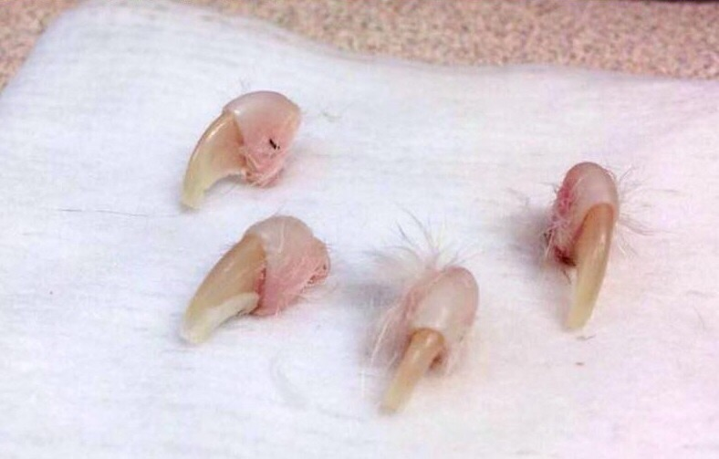

# Support for NJ A3899 / S2410 

## Bill to prohibit surgical declawing of cats

### Official Letter of Support from New Jersey animal organizations

Jan 30, 2017

Dear New Jersey Legislators,

We are rescue-and-adoption organizations and shelters in New Jersey.  We urge you to support A3899/S2410. If enacted into law, these important bills would prohibit the declawing of cats, a cruel and painful procedure where “each toe of the cat is amputated at the first joint…equivalent in a person to amputating the entire first knuckle of every finger.”
 
We are dedicated to the protection and humane treatment of cats. We promote sound and compassionate policies for cats, and we regularly advise individuals, nonprofit groups, local governments, and state policymakers on humane approaches to cats.
 
Declawing, also known as onychectomy, is rarely done for medical purposes. Studies report that an estimated 25% of cats in the United States are declawed and in almost every case, it is done merely to protect the owner’s home furnishings.
 
Cats naturally rely on their claws, using them for balance, climbing, playing, stretching to relieve stress, and protection. Regardless of surgical technique used or pain management at the time of the procedure, declawing causes disability, physical pain and chronic problems for cats long after the procedure has been completed. These problems include chronic pain in the paw, infection, arthritis, as well as joint and back pain, as the cat's biomechanics are often significantly changed as a result of the multiple changes to their anatomy.  Declawed cats, without their natural defenses, often become aggressive and are more likely to bite, which poses a greater risk to human health than scratching does. Declawed cats more often show anxieties that manifest in urinating or defecating in inappropriate places, which can often result in relinquishment of the pet to a shelter where the final result is euthanasia. 
 
Declawing simply to protect furniture or carpet is not a reason to resort to such a drastic and harmful surgery.  We educate people to use the many humane alternatives to declawing, including: rubbing or spraying scratching posts with catnip, trimming their claws, nail caps, spraying the area with a scent that cats do not like, or other readily-available deterrents.  Today, we have newer generations of affordable and accessible cat scratching furniture which have been improved to increase usage.  Cat behaviorists, who provide education about how to manage and redirect unwanted scratching behavior and their teachings, can reach much larger audiences with today's technology.
 
Human health authorities, including the CDC, NIH, the United States Public Health Service, and Canadian Medical Association agree that declawing cats does not protect human health. Declawed cats bite more often and harder and therefore can become more dangerous to immunocompromised humans. 
 
We are in existence for the sole reason of rehoming homeless cats, which includes providing care to make them adoptable. In our many years of experience carrying out our missions, we have found that cats with biting tendencies and litter box avoidance -- problems which are disproportionately found with declawed cats -- are difficult to rehome.  Based on the evidence and our extensive experience, we have concluded that declawing does not ensure homes for cats.  On the contrary, we have witnessed the exact opposite, which is why we know that declawing is more likely to lead to relinquishment of cats to shelters and to death.
 
Eight cities in California and a number of countries, such as Switzerland, Germany and the United Kingdom have already banned declawing. New Jersey would be at the forefront of this movement on the state level, ensuring that cats will no longer be put through this inhumane and painful procedure.

Sincerely yours,

### The Coalition of New Jersey Animal Welfare Organizations in Support of NJ A3899

1. Name, title, organization, town, NJ
2. Name, title, organization, town, NJ
3. Name, title, organization, town, NJ

### The Coalition of National Animal Welfare Organizations in Support of NJ A3899 

1. Paw Project, Los Angeles, CA
2. Alley Cat Allies, town, state
3. Name, town, state
4. Name, town, state

<!-- !
 [Image]{{site.baseurl}}
 
-->
 

